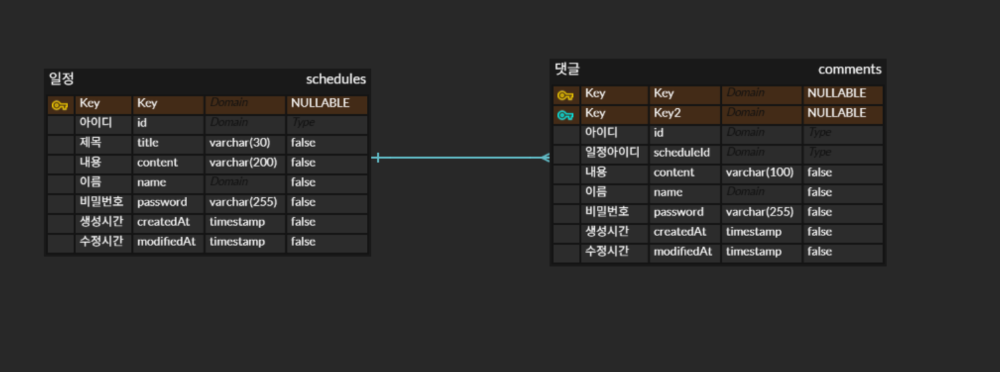

<h1>디렉토리</h1>    

    src/main/java/com/example/scheduleproject
    ├── 📁 controller
    │   ├── CommentController.java          
    │   └── ScheduleController.java         
    ├── 📁 dto
    │   ├── 📁 commentDto                   
    │   │   ├── CreateCommentRequest.java
    │   │   ├── CreateCommentResponse.java
    │   │   ├── DeleteCommentRequest.java
    │   │   ├── GetCommentResponse.java
    │   │   ├── UpdateCommentRequest.java
    │   │   └── UpdateCommentResponse.java
    │   └── 📁 scheduleDto                  
    │       ├── CreateRequest.java
    │       ├── CreateResponse.java
    │       ├── DeleteRequest.java
    │       ├── GetOneResponse.java
    │       ├── GetResponse.java
    │       ├── UpdateRequest.java
    │       └── UpdateResponse.java
    ├── 📁 entity
    │   ├── BaseEntity.java                 
    │   ├── Comment.java                    
    │   └── Schedule.java                   
    ├── 📁 global
    │   └── 📁 error
    │       ├── GlobalExceptionHandler.java 
    │       └── 📁 exception                 
    │           ├── LimitCommentException.java
    │           ├── NotEqualsPasswordException.java
    │           └── NotFoundException.java
    ├── 📁 repository
    │   ├── CommentRepository.java          
    │   └── ScheduleRepository.java        
    ├── 📁 service
    │   ├── CommentService.java          
    │   └── ScheduleService.java            
    └── ScheduleProjectApplication.java     
<h1>API 명세서</h1>

URL: localhost:8080

<h2>일정 관리 기능</h2>

| 기능             | Method | URL                              | 설명                              |
|----------------|--------|----------------------------------|---------------------------------|
| 일정 등록          | POST   | /schedules                       | 일정을 생성합니다.                      |
| 일정 조회          | GET    | /schedules/{scheduleId}          | ID를 통해 일정을 조회합니다.               |
| 사용자 이름으로 일정 조회 | GET    | /schedules?name={name}           | name을 통해서 해당 name 일정을 모두 조회합니다. |
| 일정 전체 조회       | GET    | /schedules/all                   | 모든 일정을 조회합니다. (테스트용)            |
| 일정 수정          | PUT    | /schedules/{scheduleId}          | 해당 일정을 수정합니다.                   |
| 일정 삭제          | DELETE | /schedules/{scheduleId}          | 해당 일정을 삭제합니다.                   |

<h2>댓글 관리 기능</h2>

| 기능    | Method | URL                                          | 설명                |
|-------|--------|----------------------------------------------|-------------------|
| 댓글 등록 | POST   | /schedules/{scheduleId}/comments             | 해당 일정에 댓글을 생성합니다. |
| 댓글 삭제 | DELETE | /schedules/{scheduleId}/comments/{commentId} | 해당 일정에 댓글을 삭제합니다. |

---

<h3>일정 등록</h3>

URL: /schedules

REQUEST BODY
    
    {
        "title": "String (최대 30자, 필수)",
        "content": "String (최대 200자, 필수)",
        "name": "String (필수)",
        "password": "String (필수)"
    }

RESPONSE STATUS CODE

|코드|설명|
|---|---|
|201| 생성 성공|
|400| 잘못된 요청|
|500| 서버 오류|

RESPONSE

    {
        "id": 1 
    }
---

<h3>일정 조회</h3>

URL: /schedules/1

RESPONSE STATUS CODE

| 코드  | 설명         |
|-----|------------|
| 200 | 조회 성공      |
| 400 | 잘못된 요청     |
| 404 | 존재하지 않는 요청 |
| 500 | 서버 오류      |

RESPONSE

    {
    "getResponse": {
        "id": 1,
        "title": "제목",
        "content": "내용",
        "name": "이름",
        "createdAt": "생성 시간",
        "modifiedAt": "수정 시간"
    },
    "comments": [
        {
            "id": commentId,
            "scheduleId": 1,
            "content": "내용",
            "name": "댓글 작성자 이름",
            "createdAt": "댓글 생성 시간",
            "modifiedAt": "댓글 수정 시간"
        },

ERROR CASE

    {
        "timestamp": "시간",
        "status": 404,
        "error": "Not Found",
        "message": "오류: 존재하지 않음",
        "path": "/schedules"
    }

---
<h3>사용자 이름으로 일정 조회</h3>

URL: /schedules?name=사용자 이름

RESPONSE STATUS CODE

| 코드  | 설명         |
|-----|------------|
| 200 | 조회 성공      |
| 400 | 잘못된 요청     |
| 404 | 존재하지 않는 요청 |
| 500 | 서버 오류      |

RESPONSE
    
    [
        {
            "id": 1,
            "title": "제목",
            "content": "내용",
            "name": "사용자 이름",
            "createdAt": "생성 시간",
            "modifiedAt": "수정 시간"
        }
        {
            "id": 2,
            "title": "제목",
            "content": "내용",
            "name": "사용자 이름",
            "createdAt": "생성 시간",
            "modifiedAt": "수정 시간"
        }
    ]

ERROR CASE

    {
        "timestamp": "시간",
        "status": 404,
        "error": "Not Found",
        "message": "오류: 해당하는 일정이 없습니다.",
        "path": "/schedules"
    }
---
<h3>일정 전체 조회</h3>

URL: /schedules/all

RESPONSE STATUS CODE

| 코드  | 설명         |
|-----|------------|
| 200 | 조회 성공      |
| 400 | 잘못된 요청     |
| 404 | 존재하지 않는 일정 |
| 500 | 서버 오류      |

RESPONSE
    
    {
        "id": 1,
        "title": "제목",
        "content": "내용",
        "name": "이름",
        "createdAt": "생성 시간",
        "modifiedAt": "수정 시간"
    }

ERROR CASE

    {
        "timestamp": "시간",
        "status": 404,
        "error": "Not Found",
        "message": "오류: 일정이 없습니다.",
        "path": "/schedules"
    }
---
<h3>일정 수정</h3>

URL: /schedules/1

REQUEST BODY

    {
        "title": "String (최대 30자, 필수)",
        "name": "String (필수)",
        "password": "String (필수)"
    }

RESPONSE STATUS CODE

| 코드  | 설명         |
|-----|------------|
| 200 | 수정 성공      |
| 400 | 잘못된 요청     |
| 404 | 존재하지 않는 일정 |
| 500 | 서버 오류      |

RESPONSE

    {
        "id": 1,
        "title": "제목",
        "content": "내용",
        "name": "이름",
        "modifiedAt": "수정 시간"
    }

ERROR CASE

    {
        "timestamp": "시간",
        "status": 404,
        "error": "Not Found",
        "message": "오류: 존재하지 않음",
        "path": "/schedules"
    }

---
<h3>일정 삭제</h3>

URL: /schedules/1

REQUEST BODY

    {
        "password": "String (필수)"
    }

RESPONSE STATUS CODE

| 코드  | 설명         |
|-----|------------|
| 204 | 삭제 성공      |
| 400 | 잘못된 요청     |
| 403 | 비밀번호 불일치   |
| 404 | 존재하지 않는 일정 |
| 500 | 서버 오류      |

ERROR CASE

    {
        "status": 403,
        "message": "오류: 비밀번호 불일치"
    }
---
    {
        "timestamp": "2026-02-04T11:52:35.5578062",
        "status": 404,
        "error": "Not Found",
        "message": "오류: 존재하지 않음",
        "path": "/schedules"
    }
---

<h3>댓글 생성</h3>

URL: /schedules/1/comments

REQUEST BODY

    {
        "content": "String (최대 100자, 필수)",
        "name": "String (필수)",
        "password": "String (필수)"
    }

RESPONSE STATUS CODE

| 코드  | 설명      |
|-----|---------|
| 201 | 생성 성공   |
| 400 | 잘못된 요청  |
| 500 | 서버 오류   |
---
<h3>댓글 수정</h3>

URL: /schedulse/1/comments/1

REQUEST BODY

    {
        "content": String (최대 100자, 필수)
        "password": String (필수)
    }

| 코드  | 설명         |
|-----|------------|
| 200 | 수정 성공      |
| 400 | 잘못된 요청     |
| 403 | 비밀번호 불일치   |
| 404 | 존재하지 않는 댓글 |
| 500 | 서버 오류      |

ERROR CASE

    {
        "status": 403,
        "message": "오류: 비밀번호 불일치"
    }
---
    {
        "timestamp": "시간",
        "status": 404,
        "error": "Not Found",
        "message": "오류: 존재하지 않음",
        "path": "/schedules"
    }
---

---
<h3>댓글 삭제</h3>

URL: /schedules/1/comments/1

REQUEST BODY

    {
        "password": "String (필수)"
    }

| 코드  | 설명         |
|-----|------------|
| 204 | 삭제 성공      |
| 400 | 잘못된 요청     |
| 403 | 비밀번호 불일치   |
| 404 | 존재하지 않는 댓글 |
| 500 | 서버 오류      |

ERROR CASE

    {
        "status": 403,
        "message": "오류: 비밀번호 불일치"
    }
---
    {
        "timestamp": "시간",
        "status": 404,
        "error": "Not Found",
        "message": "오류: 존재하지 않음",
        "path": "/schedules"
    }
---
<h1>ERD</h1>

